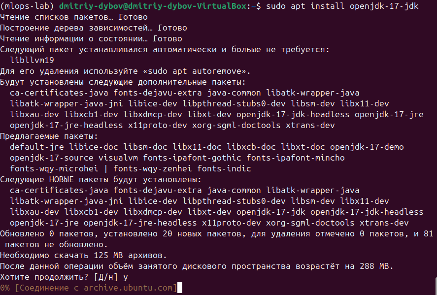
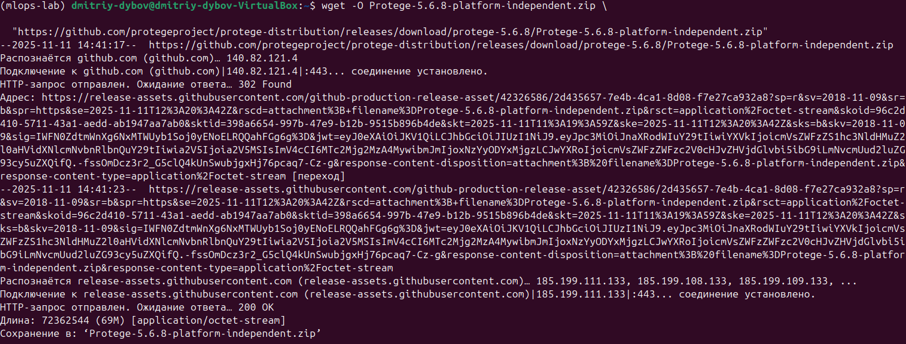
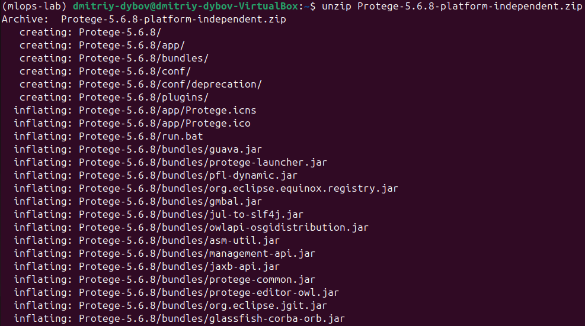
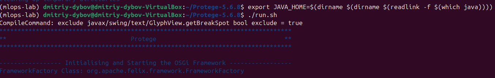
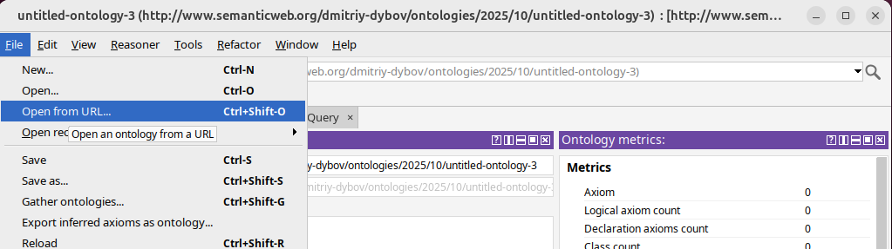
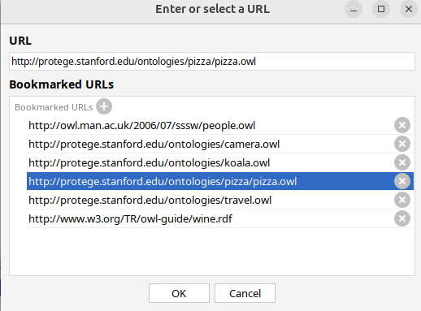
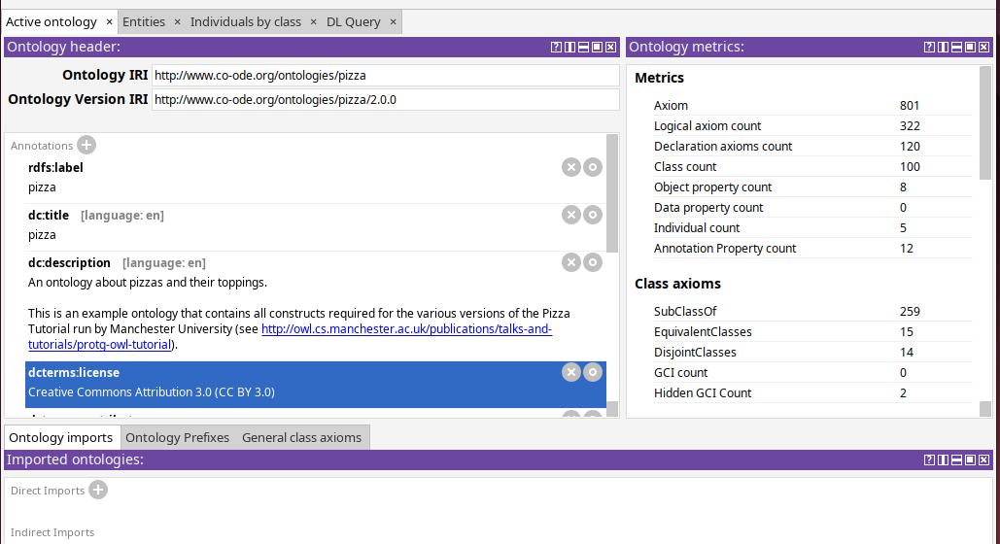

# МИНИCTEPCTBO НАУКИ И ВЫСШЕГО ОБРАЗОВАНИЯ РОССИЙСКОЙ ФЕДЕРАЦИИ
## Федеральное государственное автономное образовательное учреждение высшего образования «Северо-Кавказский федеральный университет» 
### Институт перспективной инженерии
### Отчет по лабораторной работе 4
### Знакомство с онтологиями в Protégé. Работа с SPARQL запросами. Извлечение данных с помощью LLM
Дата: 2025-11-25 \
Семестр: [2 курс 1 полугодие - 3 семестр] \
Группа: ПИН-м-о-24-1 \
Дисциплина: Технологии программирования \
Студент: Дыбов Д.В.

#### Цель работы
Освоение базовых принципов работы с онтологиями и семантическими технологиями через инструмент Protégé; изучение языка запросов SPARQL; исследование возможностей использования языковых моделей LLM для генерации SPARQL запросов по текстовым описаниям на естественном языке.

#### Теоретическая часть
- Краткие изученные концепции:
- Онтологии: классы, подклассы, свойства object properties и data properties, индивиды, аннотации.
- Protégé: загрузка, редактирование, сохранение в форматах TTL и RDF, использование reasoner для логического вывода.
- SPARQL: типы запросов SELECT, ASK, CONSTRUCT, UPDATE; PREFIX, фильтры, агрегаты.
- Apache Jena Fuseki: развертывание SPARQL endpoint, загрузка датасетов, выполнение запросов через HTTP.
- LLM: генерация SPARQL по естественному языку, необходимость валидации и пост обработки.

#### Практическая часть
##### Выполненные задачи
- [x] Установка Java для запуска Protégé.
- [x] Скачивание и запуск Protégé; загрузка образовательной онтологии; изучение классов, свойств и индивидов.
- [x] Добавление субкласса RussianPizza, аннотаций и ограничений hasTopping some RedOnion и hasTopping some Sausage.
- [x] Создание нового объектного свойства с доменом Pizza и диапазоном PizzaTopping.
- [x] Запуск reasoner и проверка автоматической классификации.
- [x] Выполнение DL Query Pizza and hasTopping value MushroomTopping.
- [x] Экспорт онтологии в ttl и rdf.
- [x] Получение отчёта об онтологии с помощью report_ontology.py.
- [x] Установка и запуск Apache Jena Fuseki; создание датасета и загрузка данных.
- [x] Написание и выполнение SPARQL запросов в sparql_queries.py.
- [x] Установка transformers, SPARQLWrapper, rdflib, openai; написание скрипта интеграции LLM для генерации SPARQL.

##### Ключевые фрагменты кода
- Скрипт 
python
```

```
##### Результаты выполнения

1. Java установлена;
2. Protégé скачан, распакован и запущен;
3. Онтология загружена и изучена.
 
Рисунок 1 — Установка Java и запуск Protégé


4. Просмотрены классы, индивиды, аннотации;


6. Добавлен RussianPizza с аннотацией и ограничениями.

 Рисунок 2 — Классы и индивиды; добавление субкласса

Reasoner и DL Query

Выполнен логический вывод; проверена автоматическая классификация; DL Query: Pizza and hasTopping value MushroomTopping.

 Рисунок 3 — Результат работы reasoner и DL Query

Экспорт онтологии и отчёт

Онтология экспортирована в ttl и rdf; отчёт сформирован скриптом report_ontology.py.

 Рисунок 4 — Экспорт и отчёт

Fuseki и загрузка данных

Apache Jena Fuseki установлен и запущен; создан датасет, загружены RDF данные; выполнены SPARQL запросы.

 Рисунок 5 — Fuseki: создание датасета и загрузка данных

SPARQL запросы и результаты

Написаны и выполнены запросы в sparql_queries.py; получены табличные результаты и подсчёты триплетов.

 Рисунок 6 — Примеры результатов SPARQL

Интеграция с LLM

Установлены transformers, SPARQLWrapper, rdflib, openai; написан скрипт генерации SPARQL из текста.

При использовании тяжёлых моделей возникали ошибки скачивания и OOM; применена distilgpt2 и режимы с ограничением памяти.

 Рисунок 7 — Генерация SPARQL с помощью LLM

Тестирование
[x] Модульные тесты — не применялись (фокус на изучении инструментов).
[x] Интеграционные тесты — проверены: Protégé ↔ экспорт RDF ↔ Fuseki ↔ SPARQLWrapper ↔ LLM.
[x] Производительность — выявлены ограничения по памяти при использовании больших LLM; рекомендовано тестировать на выделенных ресурсах.

Таблица ключевых артефактов
Артефакт	Описание
ontology.ttl	Экспорт онтологии в Turtle
ontology.rdf	Экспорт онтологии в RDF XML
report_ontology.py	Скрипт для извлечения сведений об онтологии
sparql_queries.py	Примеры SPARQL запросов и получение результатов
llm_to_sparql.py	Схема генерации SPARQL с помощью LLM
Sources: локальные результаты экспериментов и скрипты проекта

Важные замечания и рекомендации
Валидация LLM: сгенерированные LLM запросы требуют проверки; добавляйте PREFIX и проверяйте синтаксис перед выполнением.

Ресурсы: для больших моделей требуется много RAM; используйте облегчённые модели или выделенные серверы.

Резервирование данных: храните версии онтологий и делайте бэкапы Fuseki датасетов.

Воспроизводимость: фиксируйте версии библиотек в requirements.txt и сохраняйте конфигурации в config.yaml.

Выводы
Освоены базовые операции в Protégé: загрузка, редактирование онтологий, добавление классов, свойств и аннотаций, использование reasoner.

Получены практические навыки работы с SPARQL: формирование запросов, выполнение через Fuseki и программно, анализ результатов.

Исследована интеграция LLM для генерации SPARQL: подход работоспособен, но требует валидации и учёта ограничений по ресурсам; облегчённые модели и ручная пост обработка повышают надёжность.

Рекомендации: хранить версии онтологий, использовать CI для проверки целостности RDF, применять удалённые хранилища и выделенные вычислительные ресурсы для LLM задач.

Приложения
- Скрипты: report_ontology.py, sparql_queries.py, llm_to_sparql.py.
- Экспорт онтологии: ontology.ttl, ontology.rdf.
- Инструкции по запуску Fuseki и загрузке датасета (см. раздел Ключевые фрагменты кода).
- Скриншоты результатов: изображения помещены в папку report.
